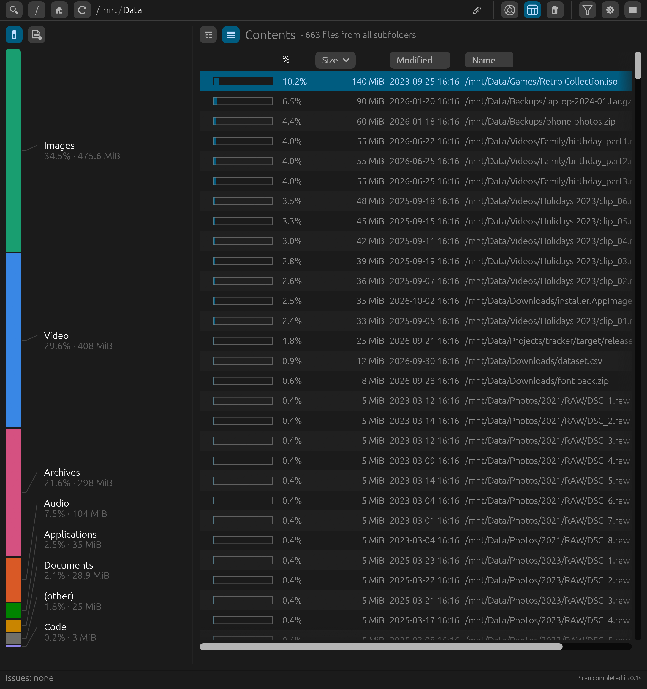

# SpaceScan

A fast disk-usage explorer for Linux. SpaceScan scans any drive, mount point
or folder and shows where the space went, as an interactive sunburst chart
or as an ncdu-style table you can drive from the keyboard. It also writes
plain-text, CSV or JSON reports from the command line.


## Features

- **Sunburst chart.** Each ring is one folder level; slices are sized by the
  space they use, and the drive's free space is shown too. Click a slice to
  zoom in, click the center to go back up. Ctrl+scroll enlarges the chart
  and dragging pans it, to reach very thin slices.
- **Colours that mean something.** A slice takes the colour of the file
  category using most of it (video, audio, images, code…), and gets darker
  the longer its files have been on the disk. A colour-blind-safe palette
  is one click away in the settings.
- **Hover details:** size, file count, owner, permissions, dates, and the
  newest and oldest file inside a folder.
- **Summary table.** Keyboard-driven, like ncdu: sort by size, name, file
  count, modified or changed time, or permissions; show, hide and reorder
  columns; jump to a name; mark several rows. A flat list shows the
  largest (or newest, or any sort) files from all subfolders at once.
  Press `?` for all shortcuts.
- **Breakdown by category and file extension** for the folder you're viewing:
  click a category or extension to show only those files (Ctrl+click picks
  several extensions).

  

- **Measure by bytes or by number of files.** Switch the whole app (chart,
  table, shares and colours) to count files instead of space, to find the
  folders full of tiny files.
- **Accurate numbers.** Sizes are real disk usage, like `du`: sparse files
  count what they actually use and hard-linked files count once. Switch to
  apparent size for network or FUSE drives that don't report disk usage.
- **Live results.** The chart and table fill in while the scan runs, with a
  progress bar when scanning a whole drive; Esc cancels.
- **Filters** by name pattern (`*.iso`, `*.[mkv,mp4]`), size range and
  created or modified dates.
- **Safe cleanup.** Move to the trash or delete permanently, always with a
  confirmation. SpaceScan refuses to delete anything that is or contains a
  mounted filesystem.
- **Copy and move.** Ctrl+C / Ctrl+X and Ctrl+V between folders, or to and
  from your file manager through the system clipboard.
- **Command-line reports** of a folder's contents, all its files, or its
  file extensions, as text, CSV or JSON (see below).
- **Handles large and awkward trees:** millions of files, very deep folders,
  paths longer than `PATH_MAX`, unreadable folders (listed as issues, not
  errors), and names in any script.
- **In ten languages:** English, Spanish, French, German, Italian,
  Portuguese, Russian, Japanese, Chinese and Korean; more can be added with
  a plain text file (see below).
- **Accessible:** usable from the keyboard alone, and the main controls are
  named for screen readers.

## Requirements

- Linux (SpaceScan uses Linux-specific filesystem interfaces), x86-64.
- A desktop session (Wayland or X11) for the app; the command-line reports
  need no display.
- `xdg-desktop-portal` for the folder picker. Without it you can still type
  a path into the path bar.
- To build: Rust 1.95 or newer.

## Installing

### AppImage

Download `SpaceScan-<version>-x86_64.AppImage` from the
[Releases](https://github.com/a-kurczyn/spacescan/releases) page, make it
executable and run it:

```sh
chmod +x SpaceScan-*-x86_64.AppImage
./SpaceScan-*-x86_64.AppImage
```

It runs on most distributions from 2018 on (glibc 2.28 or newer). Every
release is built from the tagged source in this repository.

### From source

```sh
git clone https://github.com/a-kurczyn/spacescan.git
cd spacescan
cargo install --path .
```

This builds an optimized binary and installs it to `~/.cargo/bin/spacescan`.
To build without installing, run `cargo build --release`; the binary is
`target/release/spacescan`.

## Usage

Start `spacescan`, or `spacescan PATH` to scan a folder right away. Then pick
where to scan:

- 🔍 opens a folder picker for any drive, mount point or folder,
- `/` scans the whole system, 🏠 scans your home folder,
- or type a path into the path bar and press Enter.

The toolbar switches between the chart and the summary table, sorts chart
slices by size or by name, and opens the filters and settings.

In the chart, right-click a slice to zoom, rescan, open, hide, move to the
trash or delete it. In the table, the main keys are:

| Key | Action |
|-----|--------|
| ⬆ ⬇ PgUp PgDn Home End | Move the cursor |
| ➡ / Enter | Open the folder (Enter opens a file with its default app) |
| ⬅ / Backspace | Parent folder |
| `/` | Jump to a name |
| `l` | Flat list of files from all subfolders, or back to folders |
| `s` `n` `f` `m` `c` `a` | Sort by size / name / files / modified / changed / permissions (access) |
| Space | Mark a row |
| `T` / `D` | Move to the trash / delete permanently (asks first) |
| Ctrl+C / Ctrl+X, Ctrl+V | Copy / cut, then paste into the folder shown (asks on name clashes) |
| `r` | Rescan this folder |
| `?` | All keyboard shortcuts |

### Command line

```text
spacescan COMMAND PATH [OPTIONS]

Commands:
  list   the folders and files directly in PATH, with their totals
  flat   every file under PATH, in all its subfolders
  exts   file extensions under PATH, with their sizes and file counts

Options:
  --format txt|csv|json    output format (default: txt)
  --sort size|files|name|modified|changed
                           order of list and flat (default: size; files: list only)
  --by bytes|files         order of exts (default: bytes)
  --reverse                reverse the order
  --limit N                flat: only the first N files
  --apparent-size          count file lengths instead of disk space used
  -h, --help               show this help
  -V, --version            show the version
```

For example, the 20 biggest files in your Downloads folder, or a
spreadsheet of what's in your home folder:

```sh
spacescan flat ~/Downloads --limit 20
spacescan list ~ --format csv > home.csv
```

Reports go to standard output and problems to standard error. Sizes in CSV
and JSON are in bytes, and times are local ISO 8601. The exit code is 0 on
success (unreadable subfolders are reported but don't fail the run), 1 if
the folder can't be read, and 2 for a mistake on the command line. Reports
never open a window and never change your settings.

## Configuration

Settings are saved to `~/.config/spacescan/settings.json` and can be changed
in the ⚙ panel: chart depth, minimum slice angle, slices per ring, colours
and age shades, line rendering, table columns and sort order, measuring by
bytes or files, apparent-size mode and language.

### File categories

The categories and their extensions are in
`~/.config/spacescan/categories.json`, written with the defaults on first
start. Edit it to move an extension to another category or add your own;
it's read again at every scan. Extensions in no category count as "Other".

### Adding a language

Copy `lang/en.lang` to `~/.config/spacescan/lang/<code>.lang` (for example
`nl.lang`), set the first line to `# name: <language name>`, and translate
the right-hand side of each line. It appears in Settings › Language. Any
line you leave out shows in English. A file there with the code of a
built-in language (for example `fr.lang`) changes just the lines it
contains. New translations and corrections are welcome as suggestions in an
issue.

## Contributing

Ideas, suggestions and bug reports are welcome: please open an issue.
Pull requests are welcome too; for anything bigger than a small fix,
please open an issue first. See [CONTRIBUTING.md](CONTRIBUTING.md).

SpaceScan is developed with the help of AI coding tools; every change is
reviewed by the maintainer.

## License

Copyright (C) 2026 Alejandro Kurczyn

SpaceScan is free software: you can redistribute it and/or modify it under
the terms of the GNU General Public License as published by the Free
Software Foundation, version 3 of the License only. See [LICENSE](LICENSE).
