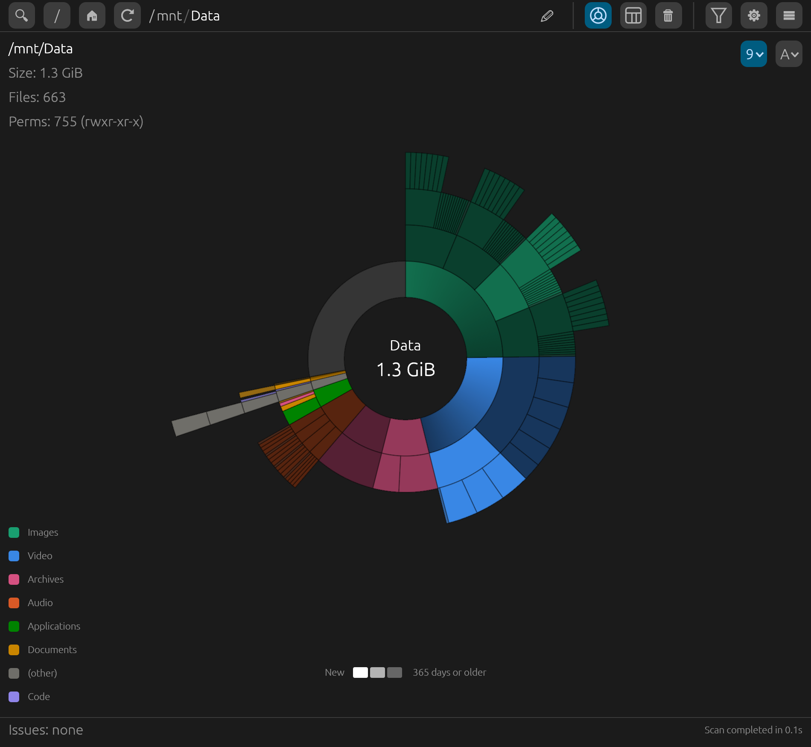

# spacemap

A fast disk-usage explorer for Linux. spacemap scans any drive, mount point
or folder and shows where the space went, as an interactive sunburst chart
or as an ncdu-style table you can drive from the keyboard.

<!--  -->

## Features

- **Sunburst chart.** Each ring is one folder level; slices are sized by the
  space they use, and the drive's free space is shown too. Click a slice to
  zoom in, click the center to go back up. Ctrl+scroll enlarges the chart
  and dragging pans it, to reach very thin slices.
  Hover for size, file count, owner, permissions and dates.
- **Summary table.** Keyboard-driven, like ncdu: sort by size, name, file
  count, modified or changed time, or permissions; show, hide and reorder
  columns; jump to a name; mark several rows. Press `?` for all shortcuts.
- **Breakdown by file extension** for the folder you're viewing.
- **Accurate numbers.** Sizes are real disk usage, like `du`: sparse files
  count what they actually use and hard-linked files count once. Switch to
  apparent size for network or FUSE drives that don't report disk usage.
- **Live results.** The chart and table fill in while the scan runs; Esc
  cancels.
- **Filters** by name pattern (`*.iso`, `*.[mkv,mp4]`), size range and
  created or modified dates.
- **Safe cleanup.** Move to the trash or delete permanently, always with a
  confirmation. spacemap refuses to delete anything that is or contains a
  mounted filesystem.
- **Handles large and awkward trees:** millions of files, very deep folders,
  paths longer than `PATH_MAX`, unreadable folders (listed as issues, not
  errors), and names in any script.
- **Translatable.** English and Spanish included; add your own language with
  a plain text file (see below).

## Requirements

- Linux (spacemap uses Linux-specific filesystem interfaces).
- A desktop session (Wayland or X11).
- `xdg-desktop-portal` for the folder picker. Without it you can still type
  a path into the path bar.
- To build: Rust 1.85 or newer (edition 2024).

## Building and installing

```sh
git clone https://github.com/<owner>/spacemap.git
cd spacemap
cargo install --path .
```

This builds an optimized binary and installs it to `~/.cargo/bin/spacemap`.
To build without installing, run `cargo build --release`; the binary is
`target/release/spacemap`.

## Usage

Start `spacemap`, then pick where to scan:

- 🔍 opens a folder picker for any drive, mount point or folder,
- `/` scans the whole system, 🏠 scans your home folder,
- or type a path into the path bar and press Enter.

The toolbar switches between the chart and the summary table, sorts chart
slices by size or by name, and opens the filters and settings.

In the chart, right-click a slice to zoom, rescan, open, hide, move to the
trash or delete it. In the table, the main keys are:

| Key | Action |
|-----|--------|
| ⬆ ⬇ PgUp PgDn Home End | Move the cursor |
| ➡ / Enter | Open the folder (Enter opens a file with its default app) |
| ⬅ / Backspace | Parent folder |
| `/` | Jump to a name |
| `s` `n` `f` `m` `c` `p` | Sort by size / name / files / modified / changed / permissions |
| Space | Mark a row |
| `T` / `D` | Move to the trash / delete permanently (asks first) |
| `r` | Rescan this folder |
| `?` | All keyboard shortcuts |

## Configuration

Settings are saved to `~/.config/spacemap/settings.json` and can be changed
in the ⚙ panel: chart depth, minimum slice angle, slices per ring, colors,
line rendering, table columns and sort order, apparent-size mode and
language.

### Adding a language

Copy `lang/en.lang` to `~/.config/spacemap/lang/<code>.lang` (for example
`fr.lang`), set the first line to `# name: <language name>`, and translate
the right-hand side of each line. It appears in Settings › Language. Any
line you leave out falls back to English. Contributions of new languages
are welcome.

## Contributing

Ideas, suggestions and bug reports are welcome: please open an issue.
Code contributions are by invitation only; see
[CONTRIBUTING.md](CONTRIBUTING.md).

spacemap is developed with the help of AI coding tools; every change is
reviewed by the maintainer.

## License

Copyright (C) 2026 Alejandro Kurczyn

spacemap is free software: you can redistribute it and/or modify it under
the terms of the GNU General Public License as published by the Free
Software Foundation, version 3 of the License only. See [LICENSE](LICENSE).
